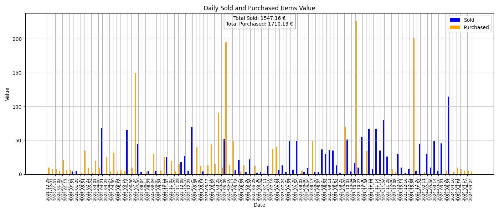

# Vinted Invoice Scraper
Because I'm a huge second-hand store fanatic, I wanted to see for how much value I sold or bought clothing.
Uses BeautifulSoup to scrape the .html file Vinted sends you.

### How to use
Download your own data from your Vinted user settings, put it in the same folder as the script (index.html from the orders folder inside the .zip)

In the main.py file, change BUYER_NAME constant to your Vinted username.

### Example graph

